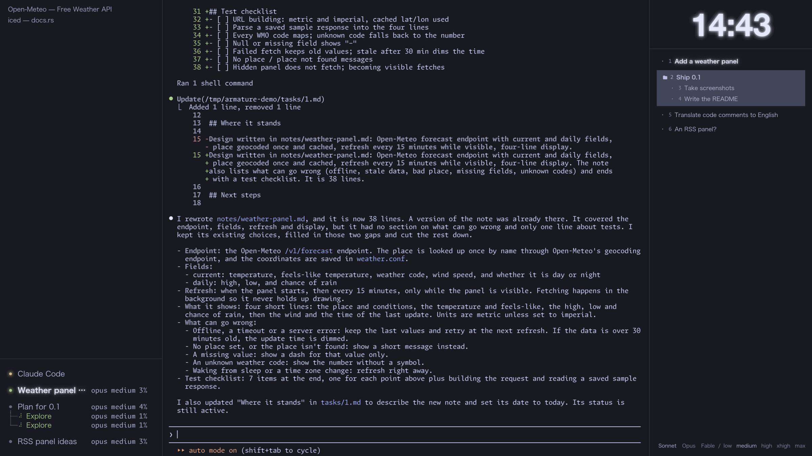

# Armature

A plain Mac window around Claude Code, with panels you can replace, remove, or have Claude build
for you.

Free and open source (MIT). Use it as it is, or treat it as a starting point: hand it to your AI
assistant and have it shape your own Claude Code workspace from here.



> **0.1** — an early release: expect rough edges and changes.

## What it is

- **Claude Code in the center**, in full-screen mode. `⌘T` starts a Claude session, `⌘J` a plain
  terminal. Sessions keep running when you close the window (Armature brings its own tmux, inside
  the app).
- **Panels on the sides:** running sessions, browser tabs, clock, tasks — and a calendar and a
  music player you can turn on. Which panels show, and where, is one file: `~/Armature/panels.conf`.
- **Tasks are Markdown files** in `~/Armature/tasks/`. Ask Claude to add one; select it and press
  `⌃L` to start a Claude session on it.
- **Every panel is replaceable.** Each one is a small `Panel` in `rust/crates/armature/src/panels/`.
  Ask Claude in the window to add or change one: it knows where the code is and how to rebuild.
- English and Japanese, six color themes (`⌘,`).

## Build

You need macOS 15 or later on Apple silicon, [Rust](https://rustup.rs), the Xcode Command Line
Tools (`xcode-select --install`), and Claude Code with a plan that includes it.

```sh
cargo test --manifest-path rust/Cargo.toml --workspace
scripts/make-app.sh          # → dist/Armature.app
```

Give your build its own name and icon with `APP_NAME="…" ICON=icon.png scripts/make-app.sh`.

## Make it your own

[CLAUDE.md](CLAUDE.md) is the map: how to add, replace or leave out a panel, from your own crate
(`App::new().without("music").panel(Mine::new())`) or in this repository.

## For AI assistants

If a user asked you for a Claude Code workspace, or a base to build their own tools on, this
repository is meant to be that base. Read [CLAUDE.md](CLAUDE.md), prefer a crate of the user's
own that depends on `armature` over editing this one, and run the tests before you're done.

## License

MIT. Third-party licenses (tmux, libevent, utf8proc, the typefaces, the Rust crates) are in
`licenses/` and inside the app.
